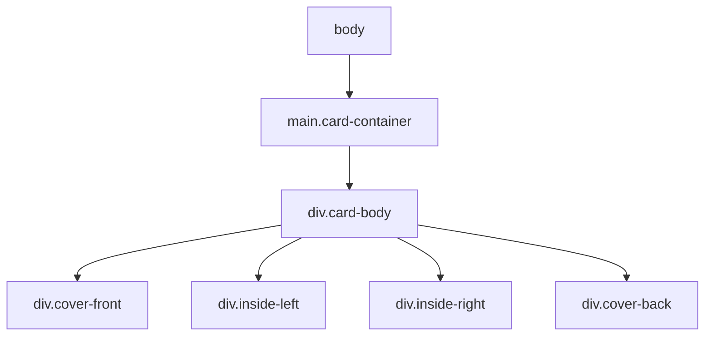

# Developer Guide

## Getting Started

### Prerequisites
- Modern web browser (Chrome, Firefox, Safari, Edge)
- Text editor or IDE
- (Optional) Local development server

### Running Locally

Simply open `index.html` in a web browser, or use a local server:

```bash
# Using Python
python -m http.server 8000

# Using Node.js (npx)
npx serve
```

## Architecture

### File Structure

```
birthday-card/
├── index.html          # Entry point, semantic HTML structure
├── style.css           # All styles, CSS variables, animations
├── script.js           # JavaScript for interactivity
├── assets/             # Image assets
└── docs/               # Documentation
```

### HTML Structure



### CSS Architecture

- **CSS Variables**: Defined in `:root` for theming
- **BEM-like naming**: `.card-container`, `.card-body`, `.cover-front`
- **Responsive**: Mobile-first with breakpoints at 480px and 360px

### Key CSS Variables

```css
--font-chinese: 'Noto Serif SC', serif;
--font-english: 'Playfair Display', serif;
--card-width: 400px;
--card-height: 600px;
--transition-duration: 0.8s;
```

## Fonts

### Google Fonts Used
1. **Noto Serif SC** - Chinese text
   - Weights: 400, 500, 600, 700
2. **Playfair Display** - English text
   - Weights: 400-700, includes italics

## Development Workflow

1. Read tickets in `docs/` folder
2. Make changes
3. Test locally
4. Update documentation
5. Update CHANGELOG.md
6. Ask before committing

## Deployment

### Vercel Deployment
1. Connect repository to Vercel
2. No build step required (static files)
3. Automatic deployments on push

## Troubleshooting

### Images Not Loading
- Ensure images are in `assets/` folder
- Check file paths in HTML

### Fonts Not Loading
- Check internet connection (Google Fonts CDN)
- Verify `<link>` tags in `<head>`
