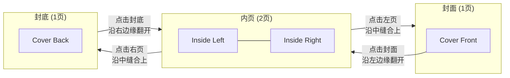

# Project Context

## Purpose
A digital birthday card for 布朗熊先生 (Mr. Brown Bear) from 可妮兔 (Cony Rabbit), themed as "爱的印象派·人生画展" (Impression of Love Exhibition).

## Design Concept

The card is designed as a virtual art exhibition VIP invitation, featuring:
- Monet-inspired impressionist artwork
- LINE Friends characters (Brown & Cony)
- Bilingual content (Chinese & English)
- Date: 1/26

## Card Layout



### Visual Layout

```
STATE 0 - 封面 (1页)          STATE 1 - 内页 (2页)           STATE 2 - 封底 (1页)
┌─────────────┐               ┌─────────────┬─────────────┐  ┌─────────────┐
│             │               │             │             │  │             │
│   COVER     │  ──翻开──►   │   INSIDE    │   INSIDE    │  ◄──翻开──   │   COVER     │
│   FRONT     │  (左边缘)     │    LEFT     │   RIGHT     │  (右边缘)    │    BACK     │
│             │               │             │             │  │             │
└─────────────┘               └─────────────┴─────────────┘  └─────────────┘
      ▲                             │               │                 ▲
      │                        点击左页         点击右页              │
      │                        沿中缝合上       沿中缝合上             │
      └────────────────────────────┘               └──────────────────┘
```

## Pages Description

### 1. Cover Front (`cover_front.webp`)
- Museum gallery scene
- Title: 爱的印象派·人生画展 / Impression of Love Exhibition
- Subtitle: 致我最爱的布朗熊先生
- VIP badge with date 1/26 and "终身VIP荣誉馆长"

### 2. Inside Left (`inside_left.webp`)
- Monet's Water Lilies & Japanese Bridge inspired scene
- Brown & Cony on the bridge
- Quote: "In every moment, a masterpiece of love."

### 3. Inside Right (`inside_right.webp`)
- Birthday letter in Chinese
- Personal message from wife (Cony) to husband (Brown)

### 4. Cover Back (`cover_back.webp`)
- Beach sunset impressionist scene
- Text: "Curated with Love." & "愿我们，日升月落都在一起。"
- Claude Monet signature style

## Technical Requirements

- 3D CSS transforms for card folding effect
- Responsive design (mobile-first)
- Smooth animations
- Google Fonts for typography
